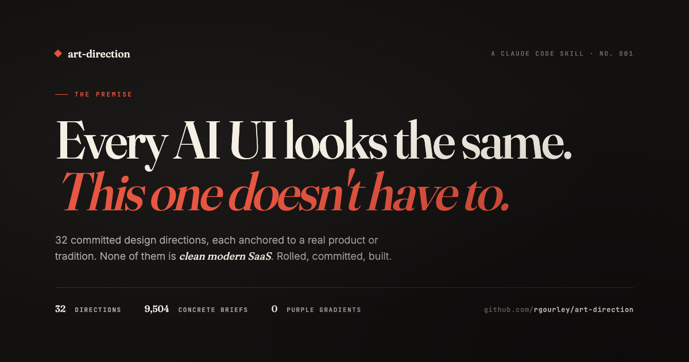

# art-direction

A Claude Code skill that stops AI-generated UI from all looking the same.



Every quality adjective (clean, modern, sleek, minimal, professional) resolves to the same point: the mean of the training data. That mean is the AI look: Inter/Geist, a purple-to-blue gradient, glassmorphism, `rounded-2xl` + `shadow-2xl` cards, a centered hero over three feature cards, emoji as icons. You cannot describe your way out of it with more quality words, because they all aim at the same center.

This skill aims somewhere else, on purpose.

The image above was designed by the skill on itself. The original random roll landed on `botanical-plate` — which needs real illustration craft that inline SVG can't produce cleanly. That surfaced a gap in the skill, now baked in as a hard rule (see [assets.md §3](references/assets.md) — don't hand-draw complex organic illustration; use public-domain illustration, a treated photograph, type-as-specimen, or a documented fit-override). Fit-override applied: `editorial-magazine · dark · display-first`. The dogfood held up; the rule tightened.

## How it works

Three levers move away from the mean, and the skill pulls all three before any code is written:

1. **Named references beat adjectives.** "Looks like Teenage Engineering" carries a thousand concrete decisions the model already knows. "Clean and modern" carries zero. The deck is 32 committed directions, each anchored to real products and design traditions.
2. **Ban-lists cut off the default path.** A visual ban-list (no purple gradient, no glassmorphism, no `rounded-2xl` reflex) and a copy ban-list (no "supercharge / seamlessly / the future of X"). Negative constraints do work positive ones can't.
3. **Commit to one coherent system up front.** Type, color, grid, motion, imagery treatment, and voice are all decided before the first component. Assembling defaults component-by-component is how the generic look creeps back in.

**Selection is seed-by-default.** The skill rolls a full brief and presents it as a recommendation, because fit-selection quietly drifts toward the safe, obvious pick and successive projects converge again. A random brief can't rationalize toward safe, and it forces divergence over time, which is the whole point. Fit-selection stays available as an explicit override for projects that genuinely demand a specific look.

Each brief is a base card (1 of 32) plus three modifiers on top: **mode** (default / dark / inverted), **scale** (display-first / balanced / body-first), and **accent** (none, or one signature move borrowed from a second card). That's **9,504 concrete briefs**, each still anchored to a real design tradition. The base card wins every conflict — modifiers dial specific slots, they don't blend cards.

**The recommendation gate.** The skill doesn't just roll and build — it rolls, presents the brief to you in text with a short rationale, and asks whether to build it or design 2 alternatives out for comparison. Accept and Claude builds. Ask for alternatives and Claude rolls 2 more and produces all 3 as real side-by-side mockups so you can pick one. Hard cap at 3, no fourth roll, no blending of the picks — that's how the anti-fit-selection thesis stays intact while still giving you director control.

Every card art-directs the words too. A risograph zine and a blueprint infra tool must not share a voice, so each direction carries a tone spec, not just a palette.

**Hero discipline.** Heros are load-bearing in a way body sections aren't, and the skill treats them that way. Every hero has to meet four demands: the base card's signature move lives IN the hero and is doing real work, the base card's craft language (letterpress offset, screentones, dimension lines, drop caps, ransom-note tape, whatever the card calls for) is visible without zooming, motion matches the card's spec, and treated media is in the hero (not later) if the card is photo/illustration-led. Under-designed heros next to over-designed accent zones are the failure mode this rule catches.

## The deck

32 directions, none of which is "clean modern SaaS" (that card is deliberately absent):

`swiss-international` · `neo-brutalist` · `raw-brutalist` · `editorial-magazine` · `terminal-mono` · `tactile-hardware` · `technical-blueprint` · `memphis-postmodern` · `humanist-warm` · `gallery-monochrome` · `retro-computing` · `risograph-print` · `sci-fi-hud` · `maximalist-expressive` · `utilitarian-dense` · `earthy-naturalist` · `bauhaus-constructivist` · `art-deco` · `frutiger-aero` · `mid-century-modernist` · `cranbrook-deconstructed` · `ukiyo-e-woodblock` · `zine-cutup` · `wabi-japanese-modernist` · `comic-pop` · `vaporwave-synthwave` · `manga-anime` · `broadsheet-newspaper` · `botanical-plate` · `crypto-defi` · `art-nouveau` · `pixel-8bit`

Each card specifies references, feel, type (with a free Google Fonts fallback), color, layout grammar, motion, a signature move, an imagery treatment, and a voice.

## Copy protections

Generic marketing-speak is the copy equivalent of the purple gradient. The skill guards against it two ways: guidance in `references/copy.md` (the tell list, per-surface fixes for headlines/CTAs/empty states/errors, and same-message-in-six-voices examples), and a runnable linter that scans product copy for AI tells:

```sh
bin/check-copy.sh src/ app/ content/
```

HARD hits (supercharge, seamlessly, "the future of", em dashes, and the rest) exit 1 so it can gate a commit or run in CI. SOFT hits (leverage, robust, moreover) warn. Point it at product copy, not the guide itself, which lists every banned phrase as an example. The em-dash ban is Rob's hard rule; drop `—` from the script's HARD list if your team allows them.

## Files

```
SKILL.md                the workflow: roll → recommend → commit → load type/imagery/voice → ban-list → spec → hero discipline → verify
references/deck.md      the 32 directions, fully specified
references/modifiers.md the modifier layer: mode × scale × accent axes (9,504 briefs total)
references/assets.md    loading fonts so they don't degrade; placeholder images; treatment recipes; orphan control
references/copy.md      anti-AI copy protections: the tell list, per-surface fixes, same-message-different-voice
bin/roll.sh             the roller: fresh brief, `--n 5` batch, `--card <name>` pinned, or replay `27.2.1.28`
bin/check-copy.sh       a linter that flags AI copy tells (hype, em dashes) with file:line; HARD hits exit 1
examples/               pages built by running the skill (see below)
assets/promo.{html,png} the repo's own promo image, designed by the skill on itself (brief 29.1.3.23)
```

## Examples

Built by actually running the skill, not hand-picked:

- **`examples/gauge-blueprint.html`** — a fit-selected SLO-monitoring SaaS landing in `technical-blueprint`. Dimension lines annotate the UI as a spec sheet.
- **`examples/marl-risograph.html`** — a random seed (`risograph-print`) applied to an indie fashion label. Overprinted spot inks, paper grain, duotone-treated placeholder photos. Proof the deck holds up even on an "off" pick.
- **`examples/frequency-editorial-dark.html`** — same product (a podcaster→sponsor SaaS) at brief `4.2.1.1`: `editorial-magazine` · dark · display-first · +swiss-international. Drop-cap serif hero, dark ink surface, strict Swiss-grid fit report card.
- **`examples/frequency-midcentury-riso.html`** — same product at brief `20.1.3.12`: `mid-century-modernist` · default · body-first · +risograph-print. Cut-paper show avatars, warm cream surface, fully riso-treated fit report (overprint, halftone, paper grain).

Open the two Frequency files side-by-side for a direct comparison: same product, opposite art direction, both produced by rolling.

## Install

The skill lives in this repo and is symlinked into Claude Code's skills directory:

```sh
ln -s ~/art-direction ~/.claude/skills/art-direction
```

Edits to the repo update the live skill. Claude Code invokes it automatically before building product UI, or on request with `/art-direction`.

Not for finance UIs (use `financial-ui-personas`) or marketing sites with an established brand system.

## Fonts and images

- **Fonts:** every card names a face and a free fallback. The skill loads it and verifies with `document.fonts.check()`, because a face that silently falls back to system/Inter has already drifted to the mean.
- **Images:** keyless placeholders (LoremFlickr, Picsum) by default, an optional Unsplash tier when an `UNSPLASH_ACCESS_KEY` is set. Every placeholder runs through the card's treatment so raw stock never breaks the aesthetic. In a CSP-locked context (Claude Artifacts) external images are blocked, so use inline SVG or CSS treatments instead. See `references/assets.md`.
