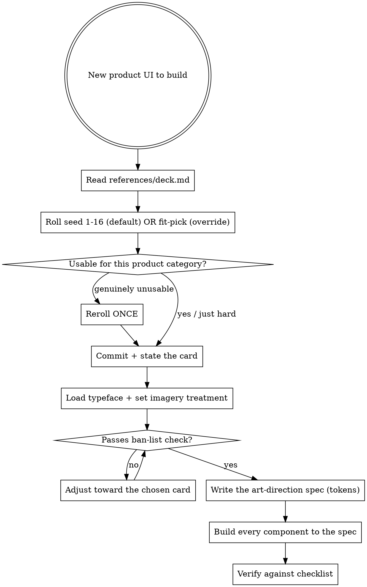

# Art Direction

## The problem this solves

Every quality adjective — clean, modern, sleek, minimal, professional — resolves to the **same point**: the mean of the training data. That mean is the AI look: Inter/Geist, a purple-to-blue gradient, glassmorphism, `rounded-2xl` + `shadow-2xl` cards, a centered hero over three feature cards, emoji as icons. You cannot describe your way out of it with more quality words, because they all aim at the same center.

Three things move away from the center, and this skill applies all three:

1. **Named references beat adjectives.** "Looks like Teenage Engineering" carries a thousand concrete decisions the model already knows. "Clean and modern" carries zero.
2. **A ban-list cuts off the default path.** Negative constraints do work positive ones can't.
3. **Commit to one coherent system up front.** The generic look also comes from assembling defaults component-by-component. Decide the whole direction *before* any JSX.

## Why a random seed, not "pick what fits"

Fit-selection has one failure mode: under pressure it quietly picks the most defensible / most generic option and rationalizes it. Even with a no-safe-card deck, "what fits an infra tool?" pulls toward the same few obvious answers, so successive projects converge again.

**So selection is seed-by-default: roll 1-16 and commit.** A seed can't rationalize toward safe. It also forces *divergence over time* — the whole point, since the complaint is "all AI design looks the same." Fit-selection stays available as an explicit **override** for projects that genuinely demand a specific look (a client brand, a hard audience constraint).

## Workflow



## Step 1 — Roll (default)

Read `references/deck.md`, then roll a real random number 1-16 and take that card:

```bash
cards=(swiss-international neo-brutalist raw-brutalist editorial-magazine terminal-mono \
  tactile-hardware technical-blueprint memphis-postmodern humanist-warm gallery-monochrome \
  retro-computing risograph-print sci-fi-hud maximalist-expressive utilitarian-dense earthy-naturalist)
idx=$(( RANDOM % 16 )); echo "seed → $((idx+1)): ${cards[$idx]}"
```

**Rotating alternative** (deterministic divergence across a set of projects): keep a counter and advance one card each new project. Indices are stable in the deck.

**Fit-selection override** — only when the project genuinely demands a specific look. Then pick by audience/category *and* say why the seed was overridden, so it's a deliberate exception, not a reflex toward safe.

## Step 2 — Commit (the guardrail)

State it plainly, then commit:

```
Rolled: <card>  (seed <n>)   [or: Fit-override: <card> — because <hard constraint>]
Product: <what it is>.  Making it work here: <the angle that fits card to product>.
Signature move I'm committing to: <the card's signature move>.
```

**Do not reroll toward something safer.** The seed is the point. Reroll *once* only if the card is genuinely unusable for the category (e.g. `terminal-mono` for a wedding florist) — and take the next roll, don't shop for the comfortable one. "This is hard to pull off" is not a reason to reroll; it's the exercise.

## Step 3 — Load the typeface, set imagery, match the voice (don't skip)

Three silent paths back to the mean, all closed here. See `references/assets.md`.

- **Typeface:** actually load the card's named face (Google Fonts / `next/font` / Fontshare / self-host). A face that falls back to system/Inter = drifted to default. Verify with `document.fonts.check("16px '<Face>'")`. On a CSP host (Artifacts), embed as data-URI or use the card's `free:` fallback deliberately.
- **Imagery:** if the card is photo/illustration-led (gallery, editorial, earthy, maximalist, fashion-riso), fill it. Use placeholders (keyless by default, or Unsplash with a key) **run through the card's imagery treatment** — never raw stock. On a CSP host, use inline SVG / CSS treatments, not external URLs. Mark placeholders `data-placeholder`; never ship them.
- **Voice:** write the copy in the card's **voice** (deck.md). The words are art direction too — a risograph zine and a blueprint infra tool must not share a tone. Headlines, CTAs, empty states, error messages, and captions all inherit the voice. Obey the copy ban-list (below). For any long-form prose, also apply the `writing-natural` skill.

## Step 4 — The ban-list (hard)

Regardless of card, do not ship these tells unless the chosen card *explicitly* calls for it:

- **Inter or Geist as the default body font** with no deliberate reason. Every card names a typeface — load and use it.
- **Purple→blue (or any) hero gradient wash.** Gradients are allowed only in `maximalist-expressive` and `defi`-flavored contexts, as bold color fields, never the lavender wash.
- **Glassmorphism** — `backdrop-blur` + translucent white card — unless the card is `sci-fi-hud` or `apple`-native.
- **`rounded-2xl` + `shadow-2xl` on every card.** Radius and shadow are per-card decisions. Several cards are 0px radius.
- **Centered hero + subhead + two buttons + three feature cards.** The single most generic layout. Almost every card implies a different structure.
- **Emoji as iconography** in a serious UI.
- **A single accent used as a full-bleed gradient background.**
- **Raw stock photos with no treatment**, or empty color blocks where a photo/illustration belongs.
- **Everything the same size.** Real direction has dramatic scale contrast.

If your draft has three or more of these, you drifted to the mean. Re-anchor on the card.

## Copy ban-list (the tonal purple gradient)

Generic SaaS marketing-speak is the copy equivalent of the AI look — it makes every product sound identical. Ban it regardless of card, then write to the card's **voice**:

- **Hype verbs with no content:** "supercharge", "unlock", "elevate", "revolutionize", "empower", "transform your workflow".
- **Empty intensifiers:** "seamlessly", "effortlessly", "blazing-fast", "next-level", "powerful yet simple", "beautifully simple".
- **Template headlines:** "The future of X", "X, reimagined", "Meet X — the Y for Z", "Everything you need to…".
- **Fake social proof filler:** "Join thousands of teams who…", "Loved by developers everywhere" (unless it's true and specific).
- **Rob's hard rules (all output):** no em dashes; vary sentence and paragraph length; don't group in threes by default; no "here's the thing / the catch?" engagement hooks; no "it's worth noting / interestingly" hedges. See `~/vaults/personal/anti-ai-writing-guide.md` and the `writing-natural` skill.
- **Tone-mismatch:** exclamation-driven hype in a `gallery-monochrome` or `swiss-international` layout; precious minimalism in a `neo-brutalist` one. The words must match the pixels.

Write real specifics — names, numbers, what the thing actually does — in the card's register. "Measured to the millisecond" (blueprint) and "Ink smudges. We keep it." (riso) say something; "Supercharge your workflow" says nothing in every font.

## Step 5 — Emit the spec before code

Write a short token spec, then build to it. One block, concrete values:

```
DIRECTION: <card name>   (seed <n> | fit-override)
TYPE:      display=<face>  body=<face>  mono=<face | none>   scale=<e.g. 14 / 20 / 48 / 96>
TYPE-LOAD: <how it loads — Google Fonts link / next/font / Fontshare / data-URI>
COLOR:     bg=<hex>  fg=<hex>  accent=<hex>  [secondary=<hex>]   (name the palette logic)
RADIUS:    <px>        BORDER: <width + color>        SHADOW: <spec | none>
GRID:      <columns / density / alignment>
MOTION:    <duration + character, e.g. 120ms instant / spring / scroll-linked>
IMAGERY:   <photo | illustration | none> · treatment=<duotone / grayscale-tint / film / cutout / …> · source=<keyless placeholder / unsplash-key / real>
VOICE:     <tone + diction + rhythm>   sample-headline="…"   sample-CTA="…"
SIGNATURE: <the one unmistakable move, and where it appears>
```

Then every component inherits these values (CSS variables / theme tokens). Do not make per-component aesthetic decisions after this point — that is how coherence leaks back to the mean.

## Verification

- [ ] Exactly one card is applied across the whole UI (at most one borrowed accent element).
- [ ] The chosen typeface(s) actually loaded — `document.fonts.check` true, not Inter-by-accident.
- [ ] The card's **signature move** is present and doing real work, not decoration.
- [ ] Copy is written in the card's **voice** and clears the copy ban-list (no "supercharge/seamlessly/the future of", no em dashes, tone matches the pixels).
- [ ] Photo/illustration-led card: imagery is filled and ran through the card's treatment (no raw stock, no empty blocks).
- [ ] Placeholders are keyless, marked `data-placeholder`, and nothing ships pointing at a placeholder host.
- [ ] Fewer than three ban-list tells in the final output (ideally zero).
- [ ] Scale contrast is visible (headline vs body is dramatic, not uniform).
- [ ] Radius, border, and shadow match the card — not `rounded-2xl` reflex.
- [ ] Light and dark both defined if the product needs both.
- [ ] The seed (or the fit-override reason) was actually stated, and no reroll-to-safe happened.

## When NOT to use this skill

- **Finance/markets UIs** — use `financial-ui-personas` (calibrated deck) + `financial-ui-patterns` (correctness) instead.
- **An existing product with an established design system** — match the system, don't re-art-direct it.
- **A tiny one-component tweak** inside an existing look.

## See also

- `references/deck.md` — the 16 directions (each with type, imagery, and a signature move).
- `references/assets.md` — loading fonts so they don't degrade, and placeholder image sources + treatment recipes.
- `product-design` — atomic correctness (spacing, contrast, interaction) under any direction. Apply it *with* the chosen card.
- `financial-ui-personas` — the finance-specific version of this idea.
- `frontend-design` (plugin) — generic distinctive UI generation.
