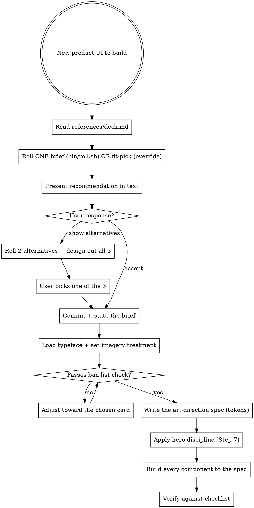

# Art Direction

## The problem this solves

Every quality adjective (clean, modern, sleek, minimal, professional) resolves to the **same point**: the mean of the training data. That mean is the AI look: Inter/Geist, a purple-to-blue gradient, glassmorphism, `rounded-2xl` + `shadow-2xl` cards, a centered hero over three feature cards, emoji as icons. You cannot describe your way out of it with more quality words, because they all aim at the same center.

Three things move away from the center, and this skill applies all three:

1. **Named references beat adjectives.** "Looks like Teenage Engineering" carries a thousand concrete decisions the model already knows. "Clean and modern" carries zero.
2. **A ban-list cuts off the default path.** Negative constraints do work positive ones can't.
3. **Commit to one coherent system up front.** The generic look also comes from assembling defaults component-by-component. Decide the whole direction *before* any JSX.

## Why a random seed, not "pick what fits"

Fit-selection has one failure mode: under pressure it quietly picks the most defensible / most generic option and rationalizes it. Even with a no-safe-card deck, "what fits an infra tool?" pulls toward the same few obvious answers, so successive projects converge again.

**So selection is seed-by-default: roll a brief and commit.** The roller picks a base card (1-32) *and* three modifiers on top (mode, scale, accent) — 9,504 possible briefs, every one still anchored to a real design tradition. A seed can't rationalize toward safe. It also forces *divergence over time*, the whole point, since the complaint is "all AI design looks the same." Fit-selection stays available as an explicit **override** for projects that genuinely demand a specific look (a client brand, a hard audience constraint).

## Workflow



## Step 1: Roll ONE brief and present it in text

Read `references/deck.md`, then roll a single brief with `bin/roll.sh`:

```bash
bin/roll.sh
# → DIRECTION: manga-anime  (base 27)
#   MODE:      dark
#   SCALE:     display-first
#   ACCENT:    +broadsheet-newspaper
#   BRIEF-ID:  27.2.1.28
```

The roller picks a base card (1-32) *and* three modifiers on top:

- **mode** — default / dark / inverted (card overrides for paper-based cards)
- **scale** — display-first / balanced / body-first
- **accent** — none, or one signature move borrowed from a second card

That's a space of **9,504 concrete briefs**, each still anchored to a real tradition (see `references/modifiers.md`). The base card carries the surface; modifiers dial specific slots. **No blending.**

**Fit-override** (only when the project genuinely demands a specific look — a client brand, a hard audience constraint). Say why the seed was overridden, so it's deliberate:
```bash
bin/roll.sh --card technical-blueprint
```

## Step 2: Present the recommendation to the user

Before touching code, present the rolled brief to the user **in text only**. This is the recommendation. Keep it short and honest, no persuasion:

```
Recommended direction: <card>  (brief-id <c.m.s.a>)
Modifiers: mode=<…>  scale=<…>  accent=<none|+card>

Why it fits <product>: <one sentence on the angle that makes card+product work>.
Signature move: <what will be unmistakable in the final UI>.
Voice sample: "<a one-line headline in the card's voice>"
Accent placement (if any): <the one surface it lives on>.

Ready to build this, or want to see 2 alternatives designed out to compare?
```

Then wait for the user. Two paths:

- **User accepts** → skip to Step 3 (commit and build). This is the default path and should be common. A single-committed direction is the whole point of the skill.
- **User says "show alternatives"** (or equivalent) → roll two more briefs, then **design out all three** as actual side-by-side mockups (hero surface + one representative component, in real HTML/JSX with real type and imagery treatments, not text descriptions). Present all three, let the user pick one. That pick becomes the committed brief.

Rules for the alternatives round:

```bash
bin/roll.sh --n 2         # produces two more briefs
```

- Design out **at most 3 total** (the recommendation + 2 alternatives). Never more; the whole thesis dies if you keep shopping.
- The alternatives are *real designs*, not sketches or descriptions. If you're not going to actually design them out, don't offer them.
- After the user picks, the other two are gone. No hybrid, no "combine A's palette with B's layout."
- If none of the three work for the user, that is a **fit-override** situation, not a fourth roll. Use `--card` explicitly and state the hard constraint.

## Step 3: Commit (the guardrail)

State it plainly, then commit:

```
Committed: <card>  (brief-id <c.m.s.a>)   [or: Fit-override: <card>, because <hard constraint>]
Modifiers: mode=<default|dark|inverted>  scale=<display-first|balanced|body-first>  accent=<none|+card>
Chosen via: <accepted recommendation | picked from 3 alternatives | fit-override>
Product: <what it is>.  Making it work here: <the angle that fits card to product>.
Signature move I'm committing to: <the card's signature move>.
Accent placement (if any): <the one surface where the accent lives, doing one job>.
```

**Do not reroll toward something safer.** The brief is the point. "This is hard to pull off" is not a reason to reroll; it's the exercise.

Modifiers never trigger a reroll on their own. If a mode/scale/accent conflicts with the card, the **card wins**, take the nearest compatible interpretation (the roller pre-applies this for paper-based cards; you apply it for the rest).

**Extra rollers, for other jobs:**
```bash
bin/roll.sh 27.2.1.28   # replay a specific brief (share, or keep 6 pages consistent)
bin/roll.sh --n 5       # check divergence across an imagined project set
```

**Rotating alternative** (deterministic divergence across your projects): advance the base card by 1 each new project and re-roll the modifiers.

## Step 4: Load the typeface, set imagery, match the voice (don't skip)

Three silent paths back to the mean, all closed here. See `references/assets.md`.

- **Typeface:** actually load the card's named face (Google Fonts / `next/font` / Fontshare / self-host). A face that falls back to system/Inter = drifted to default. Verify with `document.fonts.check("16px '<Face>'")`. On a CSP host (Artifacts), embed as data-URI or use the card's `free:` fallback deliberately.
- **Imagery:** if the card is photo/illustration-led (gallery, editorial, earthy, maximalist, fashion-riso), fill it. Use placeholders (keyless by default, or Unsplash with a key) **run through the card's imagery treatment**, never raw stock. On a CSP host, use inline SVG / CSS treatments, not external URLs. Mark placeholders `data-placeholder`; never ship them.
- **Voice:** write the copy in the card's **voice** (deck.md). The words are art direction too, a risograph zine and a blueprint infra tool must not share a tone. Headlines, CTAs, empty states, error messages, and captions all inherit the voice. Obey the copy ban-list (below). For any long-form prose, also apply the `writing-natural` skill.

## Step 5: The ban-list (hard)

Regardless of card, do not ship these tells unless the chosen card *explicitly* calls for it:

- **Inter or Geist as the default body font** with no deliberate reason. Every card names a typeface, load and use it.
- **Purple→blue (or any) hero gradient wash.** Gradients are allowed only in `maximalist-expressive` and `defi`-flavored contexts, as bold color fields, never the lavender wash.
- **Glassmorphism**, `backdrop-blur` + translucent white card, unless the card is `sci-fi-hud` or `apple`-native.
- **`rounded-2xl` + `shadow-2xl` on every card.** Radius and shadow are per-card decisions. Several cards are 0px radius.
- **Centered hero + subhead + two buttons + three feature cards.** The single most generic layout. Almost every card implies a different structure.
- **Emoji as iconography** in a serious UI.
- **A single accent used as a full-bleed gradient background.**
- **Raw stock photos with no treatment**, or empty color blocks where a photo/illustration belongs.
- **Everything the same size.** Real direction has dramatic scale contrast.

If your draft has three or more of these, you drifted to the mean. Re-anchor on the card.

## Copy ban-list (the tonal purple gradient)

Generic SaaS marketing-speak is the copy equivalent of the AI look: it makes every product sound identical. The full list, per-surface fixes, and same-message-different-voice examples are in `references/copy.md`. The high-signal bans, regardless of card:

- **Hype verbs:** supercharge, unlock, elevate, empower, revolutionize, unleash, "take it to the next level".
- **Empty intensifiers:** seamlessly, effortlessly, blazing-fast, next-level, "powerful yet simple", cutting-edge.
- **Template headlines:** "The future of X", "X, reimagined", "Everything you need to…", "Say goodbye to X".
- **Fake proof:** "Join thousands of teams", "Loved by developers everywhere" (unless true and specific).
- **Hard rules (all output):** no em dashes; vary sentence and paragraph length; don't group in threes by default; no engagement hooks ("here's the thing", "the catch?") or hedges ("it's worth noting"). See `writing-natural` and `~/vaults/personal/anti-ai-writing-guide.md`.
- **Tone-mismatch:** exclamation hype in a `gallery-monochrome` or `swiss-international` layout; precious minimalism in a `neo-brutalist` one. The words must match the pixels.

**Enforce it, don't just intend it:** run `bin/check-copy.sh <your copy paths>` before commit. HARD hits (hype + em dashes) exit 1; SOFT hits warn. Write real specifics in the card's register instead: "Measured to the millisecond" (blueprint) and "Ink smudges. We keep it." (riso) say something; "Supercharge your workflow" says nothing in every font.

## Step 6: Emit the spec before code

Write a short token spec, then build to it. One block, concrete values:

```
DIRECTION: <card name>   (brief-id <c.m.s.a> | fit-override)
MODIFIERS: mode=<default|dark|inverted>  scale=<display-first|balanced|body-first>  accent=<none|+card>
TYPE:      display=<face>  body=<face>  mono=<face | none>   scale=<e.g. 14 / 20 / 48 / 96 or 160 for display-first>
TYPE-LOAD: <how it loads, Google Fonts link / next/font / Fontshare / data-URI>
COLOR:     bg=<hex>  fg=<hex>  accent=<hex>  [secondary=<hex>]   (name the palette logic; note any mode inversion)
RADIUS:    <px>        BORDER: <width + color>        SHADOW: <spec | none>
GRID:      <columns / density / alignment>   (reflects scale personality)
MOTION:    <duration + character, e.g. 120ms instant / spring / scroll-linked>
IMAGERY:   <photo | illustration | none> · treatment=<duotone / grayscale-tint / film / cutout / …> · source=<keyless placeholder / unsplash-key / real>
VOICE:     <tone + diction + rhythm>   sample-headline="…"   sample-CTA="…"
SIGNATURE: <the one unmistakable move, and where it appears>
ACCENT:    <the one surface the accent card lives on, and what signature move it borrows>   (or "none")
```

Then every component inherits these values (CSS variables / theme tokens). Do not make per-component aesthetic decisions after this point, that is how coherence leaks back to the mean.

## Step 7: Hero discipline (heros are load-bearing)

Every component gets the spec, but heros carry disproportionate weight. They're the first surface, the most-scrutinized surface, and the one where the AI-generic look is easiest to catch. A designer spends 40% of the effort on the hero and nav — the skill should reflect that, not pretend all surfaces are equal work.

The imbalance to watch for: the accent card's zone (if any) gets visible craft — texture, offset, halftone, dimension lines — but the hero (base card's surface) stays clean vector art. When the accent zone looks *made* and the hero looks *rendered*, the hero is under-designed for the direction. Fix by pulling the **base card's own craft moves** into the hero, not by moving the accent up (that violates the one-accent-one-surface rule).

Four demands the hero has to meet, per card:

1. **Signature move present and load-bearing.** The card's signature move (deck.md) lives IN the hero and is doing work, not decoration. Editorial → drop cap + hanging pull-quote in the hero, not saved for a later section. Mid-century → cut-paper illustration built from 3-5 flat shapes IS the hero, not a small icon. Blueprint → dimension lines annotating the hero itself. If you'd swap out the signature move and the hero would still read the same, it wasn't load-bearing.

2. **Craft language visible without zooming.** Every card has its own craft vocabulary — a way it looks *made*. Pull it into the hero at scale a scanning eye can see: letterpress offset for mid-century, screentones for manga, dimension lines and corner marks for blueprint, grain + overprint for riso, drop-cap for editorial, beveled 3D chrome for retro-computing, chrome outlines + scanlines for vaporwave. If the accent zone has any surface treatment (texture / offset / halftone), the hero needs an equivalent from the base card's vocabulary.

3. **Motion matches the card's motion spec.** No static hero if the card's motion is anything other than "none." Editorial → slow scroll-linked fade on the pull-quote. Mid-century → gentle character idle-drift on the illustration. Sci-fi-hud → glow pulse or scanline sweep. Riso → grain shimmer. A static hero on a motion-carrying card is a tell.

4. **Photo/illustration-led card → treated media IN the hero.** If the card's imagery treatment is anything but "avoid" (gallery, editorial, earthy, maximalist, mid-century, botanical, ukiyo-e, art-deco, mid-century, wabi), the treated photo or illustration appears in the hero — not three scrolls down in a "figure" section. The hero is where the treatment either lands or doesn't.

Fifth rule, everywhere: **voice sample lives in the hero copy**, not saved for essay body. The card's voice register has to be recognizable in the headline and lede, not just in the fine print.

## Verification

- [ ] Exactly one **base card** is applied across the whole UI. The accent card (if rolled) shows up in **one** place, doing one job, never blended.
- [ ] The rolled **modifiers** are visibly applied: mode (surface color reflects it), scale (headline/body ratio matches the personality), accent (present in exactly one surface, or none).
- [ ] The chosen typeface(s) actually loaded, `document.fonts.check` true, not Inter-by-accident.
- [ ] The card's **signature move** is present and doing real work, not decoration.
- [ ] **Hero discipline** (see Step 7): signature move lives IN the hero and is load-bearing; base card's craft language visible without zooming; motion matches the card's spec; treated media in the hero if the card is photo/illustration-led; voice sample in the hero copy, not saved for body.
- [ ] Copy is in the card's **voice** and clears `bin/check-copy.sh` (zero HARD hits: no hype phrases, no em dashes), tone matching the pixels.
- [ ] Photo/illustration-led card: imagery is filled and ran through the card's treatment (no raw stock, no empty blocks).
- [ ] Placeholders are keyless, marked `data-placeholder`, and nothing ships pointing at a placeholder host.
- [ ] Fewer than three ban-list tells in the final output (ideally zero).
- [ ] Scale contrast is visible (headline vs body is dramatic, not uniform).
- [ ] No orphans — a single word alone on the last line of a headline or paragraph. `text-wrap: balance` on heads, `text-wrap: pretty` on prose (see `references/assets.md`).
- [ ] Radius, border, and shadow match the card, not `rounded-2xl` reflex.
- [ ] Light and dark both defined if the product needs both.
- [ ] The **brief-id** (or the fit-override reason) was actually stated, and no reroll-to-safe happened.
- [ ] The recommendation was **presented to the user in text before any code was written**, and either accepted or resolved via the 3-alternatives gate. No silent auto-build.

## When NOT to use this skill

- **Finance/markets UIs**, use `financial-ui-personas` (calibrated deck) + `financial-ui-patterns` (correctness) instead.
- **An existing product with an established design system**, match the system, don't re-art-direct it.
- **A tiny one-component tweak** inside an existing look.

## See also

- `references/deck.md`, the 32 directions (each with type, imagery, voice, and a signature move).
- `references/modifiers.md`, the modifier layer: mode / scale / accent axes that ride on top of the base card without diluting it (9,504 concrete briefs).
- `bin/roll.sh`, the roller: `bin/roll.sh` for a fresh brief, `bin/roll.sh <brief-id>` to replay one, `bin/roll.sh --n 5` to check divergence, `bin/roll.sh --card <name>` for a pinned base.
- `references/assets.md`, loading fonts so they don't degrade, and placeholder image sources + treatment recipes.
- `references/copy.md` + `bin/check-copy.sh`, the anti-AI copy protections: the tell list, per-surface fixes, and a runnable linter that gates commits.
- `product-design`, atomic correctness (spacing, contrast, interaction) under any direction. Apply it *with* the chosen card.
- `financial-ui-personas`, the finance-specific version of this idea.
- `frontend-design` (plugin), generic distinctive UI generation.
